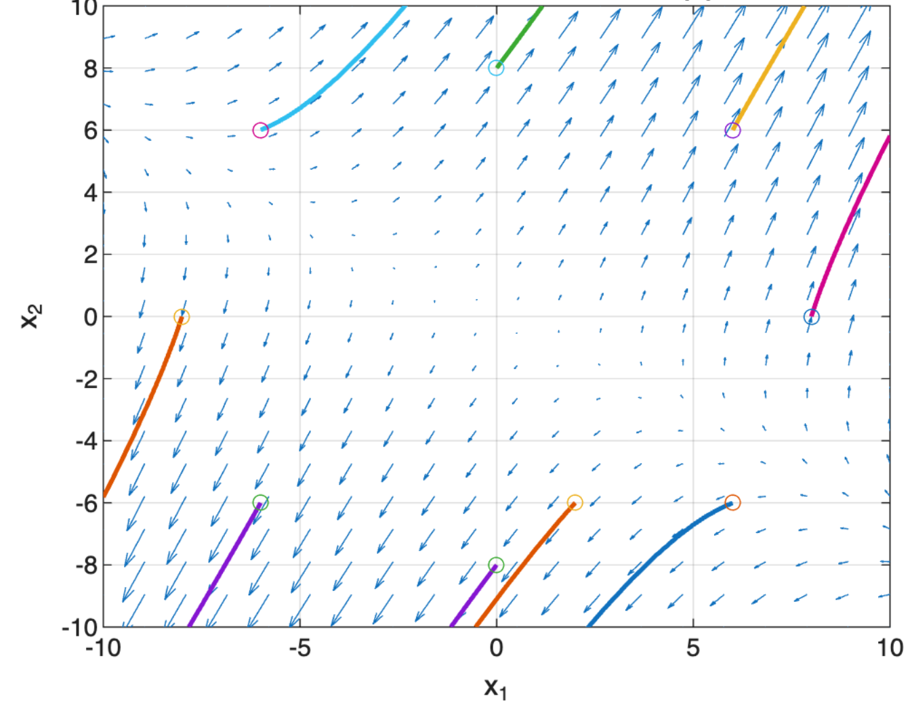

# Differential Equations and Dynamic Systems Modeling

## Overview

This was one of my favorites. In this project, I explored several differential equation models used to represent dynamic systems. The work included population growth, electrical circuit behavior, forced response systems, and linear systems of differential equations.

The goal was to solve and visualize dynamic models using both analytical methods and MATLAB-based computational tools.

This public version summarizes the modeling approach and selected conclusions while omitting course specific prompts, assignment structure, and full solution code. - Tom

## Tools and Methods

- MATLAB
- First order differential equations
- Logistic population modeling
- Linear systems of differential equations
- Eigenvalue and eigenvector analysis
- Direction fields and phase portraits
- Numerical solutions using `ode45`
- Symbolic solutions using `dsolve`
- Laplace transforms
- Unit-step inputs
- Forced response modeling
- Visualization of dynamic behavior

## Modeling Approach

This project combined analytical solution methods with computational modeling.

For population models, differential equations were used to describe growth over time and evaluate long-term behavior under limiting conditions.

For linear systems, matrix methods were used to compute eigenvalues and eigenvectors, solve coupled differential equations, and classify equilibrium behavior. MATLAB visualizations were used to show direction fields and phase portraits.

For forced response and circuit style models, Laplace transforms and unit-step inputs were used to analyze how systems respond to external forcing functions or changes in input over time.

## Selected Visual

## Selected Result

This visualization shows the phase plane behavior of a linear system of differential equations. The direction field and sample trajectories illustrate how different initial conditions evolve over time and help reveal the qualitative structure of the system.

This visual was especially useful for me because it connected analytical methods such as eigenvalue and eigenvector analysis with geometric interpretation. Rather than viewing the system only as algebra, the plot made stability behavior and trajectory patterns easier to understand.

## Key Findings

This project demonstrated how differential equations can describe systems whose behavior changes over time. Analytical solutions provided exact forms where possible. MATLAB tools made it easier to visualize trajectories, transient behavior, and long term system behavior.

Eigenvalue and eigenvector analysis here was especially useful for understanding stability, direction of motion, the qualitative behavior of linear systems, and for helping me decide my github username.

For me, this project reinforced the importance of pairing symbolic or numerical solutions with visual interpretation. Phase portraits, direction fields, and time series plots helped make system behavior easier to interpret.

## Skills Demonstrated

- Translating dynamic scenarios into differential-equation models
- Solving first order and linear system differential equations
- Using MATLAB for symbolic and numerical analysis
- Applying eigenvalue/eigenvector methods to classify system behavior
- Creating phase portraits and direction fields
- Interpreting model behavior over time
- Communicating assumptions, methods, and limitations clearly

## Engineering Connection

This project connects directly to systems engineering because dynamic systems often require understanding how state variables change over time. The work demonstrates model formulation, state based reasoning, stability analysis, response to inputs, and visual communication of system behavior.

These skills are relevant to engineering problems involving feedback, motion, growth, decay, electrical behavior, and other time-dependent processes.

## Tom's Academic Integrity Note

This page is a public facing project summary. Full assignment prompts, course specific materials, instructor provided templates, and complete solution files are intentionally omitted.
