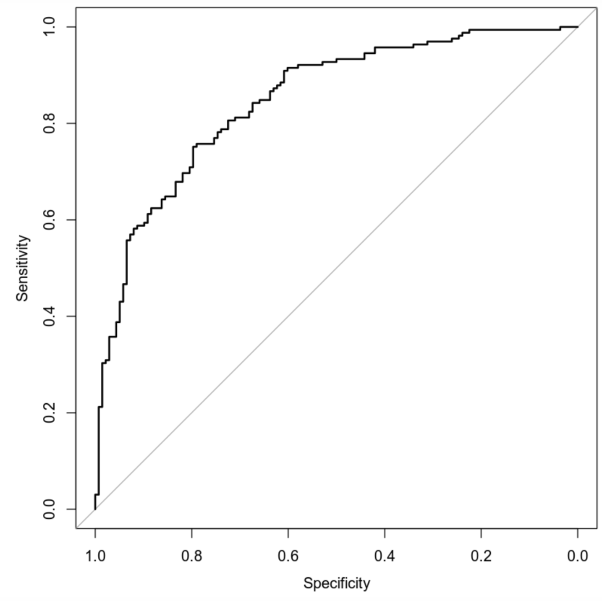

# Statistical Modeling of Heart Disease Risk

## Overview

Hello. I developed this project in an advanced statistics course I took. In this project, I used a clinical heart disease dataset to examine how patient characteristics and medical indicators relate to the presence of heart disease.

My goal was to compare interpretable statistical modeling methods with machine learning classification methods and evaluate how well different models predicted heart disease status.

This public version summarizes the modeling approach and selected conclusions while omitting course-specific prompts, assignment structure, and full solution code. - Tom

## Tools and Methods

- R / RStudio
- Logistic regression
- Random forest classification
- Random forest regression
- Model comparison
- Confusion matrices
- Accuracy, precision, recall, and AUC
- AIC-based model comparison
- Hosmer-Lemeshow goodness-of-fit testing
- RMSE evaluation

## Dataset

The dataset contained 303 observations and clinical variables related to cardiovascular health. Variables included age, sex, chest pain type, resting blood pressure, cholesterol, maximum heart rate achieved, exercise induced angina, and a target variable indicating whether heart disease was present.

## Modeling Approach

This project compared multiple models:

The logistic regression models were used to estimate the probability of heart disease based on selected clinical predictors. These models emphasized interpretability and allowed individual predictors to be evaluated in terms of their relationship to the outcome.

The random forest classification model was used as a more flexible machine learning approach for predicting heart disease status. A separate random forest regression model was used to predict maximum heart rate achieved.

## Selected Visual

## Selected Result

This ROC curve shows the tradeoff between sensitivity and specificity for a heart disease risk classification model. The curve sits above the diagonal reference line, indicating that the model performs better than random classification.

This visualization was useful for me because it evaluated classification performance across different decision thresholds rather than relying only on a single accuracy value.

## Key Findings

This project showed how different modeling methods can be used for different analytical goals.

Logistic regression provided interpretable coefficients and model-fit diagnostics, making it useful for explaining relationships between predictors and heart disease status.

Random forest methods provided a flexible predictive approach and helped compare machine learning performance against more traditional statistical models.

The project emphasized model evaluation rather than simply building models. Performance was assessed using statistical tests, classification metrics, and predictive-error measures.

## Skills Demonstrated

- Preparing and interpreting a clinical dataset
- Building logistic regression models in R
- Comparing statistical and machine learning approaches
- Evaluating classification performance
- Interpreting confusion matrices and model diagnostics
- Communicating model strengths, limitations, and appropriate use cases

## Tom's Academic Integrity Note

This page is a public facing project summary. Full assignment prompts, course specific materials, instructor provided templates, and complete solution files are intentionally omitted.
