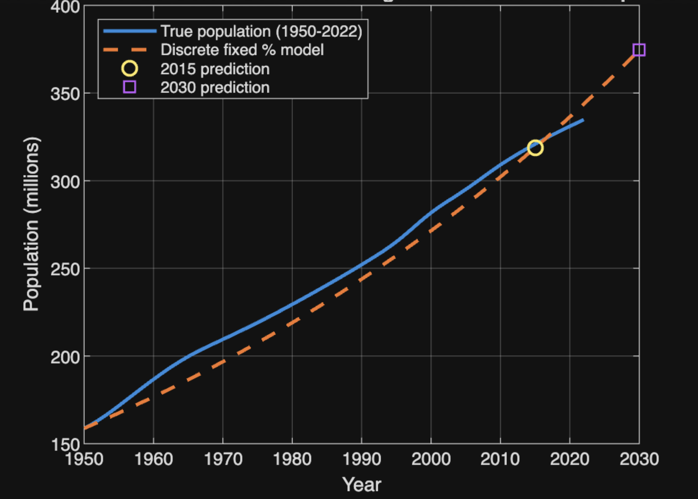

# Population Growth Modeling with Real-World Data

## Overview

In this project, I compared multiple population growth models against real-world U.S. population data from 1950 through 2022.

My goal was to evaluate how different mathematical model structures behave when applied to historical population data, then use those models to generate forecasts for selected future years.

This public version summarizes the modeling approach and selected conclusions while omitting course-specific prompts, assignment structure, and full solution code. - Tom

## Tools and Methods

- MATLAB
- Discrete fixed-percentage growth modeling
- Continuous exponential growth modeling
- Carrying-capacity / logistic-style modeling
- Data visualization
- Forecasting
- Percentage-error analysis
- Model comparison using real-world data

## Dataset

This project used U.S. population data from 1950 through 2022, with the dataset obtained from a United Nations website. The historical data were used to compare model predictions against observed population values and evaluate how well each model captured long-term population trends.

## Modeling Approach

This project compared several model types:

The first model used a discrete fixed percentage growth approach. This model updated population values year by year using a constant annual growth rate.

The second model used a continuous fixed-percentage model based on exponential growth. This treated population as a continuous function of time rather than a year by year recursion.

The third model incorporated a carrying capacity concept. This allowed the model to represent growth that slows as population approaches an upper limiting value, which is often more realistic for long-term population modeling than indefinite exponential growth.

Each model was used to estimate population values over the historical period and generate forecasts for 2015 and 2030. Model outputs were compared visually and by calculating percentage error against observed values.

## Selected Visual

## Selected Result

This visualization compares a discrete fixed percentage population model with observed U.S. population data from 1950 through 2022. The model captures the general long-term growth trend but does not perfectly match the observed population curve across the full historical period.

The forecast markers for 2015 and 2030 show how a simple growth model can be extended beyond the observed data, while also illustrating why model assumptions and error diagnostics matter when using mathematical models for prediction.

## Key Findings

The big takeaway from this project is that model structure matters. A simple fixed percentage model can be useful for short term approximation, but it may become less realistic when extended over longer time periods.

Comparing model predictions against historical data made it possible to evaluate the strengths and limitations of each approach. Visualizations helped show where models tracked the observed data well and where they began to diverge.

The carrying capacity model provided a useful way to think about population growth as a system with constraints rather than as unlimited exponential growth.

## Skills Demonstrated

- Translating a real-world question into mathematical model structures
- Building discrete and continuous models in MATLAB
- Comparing model predictions against historical data
- Generating forecasts from mathematical models
- Calculating and interpreting percentage error
- Creating clear visualizations of model behavior
- Communicating model assumptions, limitations, and tradeoffs

## Tom's Academic Integrity Note

This page is a public facing project summary. Full assignment prompts, course specific materials, instructor provided templates, and complete solution files are intentionally omitted.
