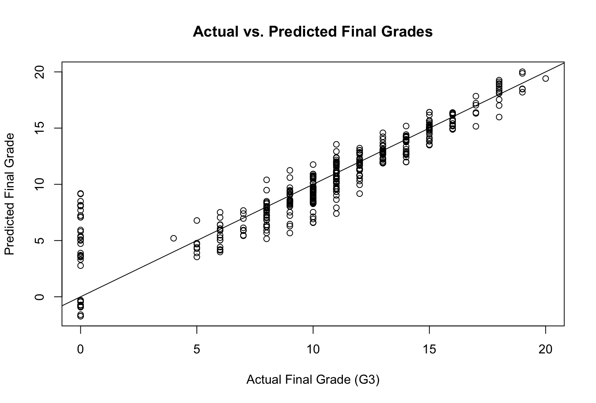

# Predicting Student Performance Using Regression

## Overview

Hello! This was part of a project I did for my applied mathematics seminar. This project examines how selected behavioral and academic history variables relate to final mathematics performance using the UC Irvine Student Performance dataset.

My goal was to build interpretable regression models and compare whether behavioral factors alone were useful predictors, or whether prior academic performance substantially improved predictive accuracy.

This public version summarizes the modeling approach and selected conclusions while omitting course specific prompts, assignment structure, and full solution code. - Tom

## Tools and Methods

- R / RStudio
- Multiple linear regression
- Correlation analysis
- Model comparison using R² and adjusted R²
- ANOVA model comparison
- Residual diagnostics
- Actual-versus-predicted evaluation

## Research Question

To what degree can selected behavioral and academic-history factors predict final mathematics performance?

## Modeling Approach

The project compared two regression models.

The first model used behavioral engagement variables only. This provided a simple baseline model and helped test whether variables such as attendance and study time had meaningful predictive value by themselves.

The second model added academic history variables, including prior grading period performance and prior course failures. This expanded model was used to evaluate whether previous academic performance improved prediction of the final mathematics grade.

## Selected Visual

## Selected Result

This visualization compares observed final mathematics grades with the values predicted by the regression model. Points closer to the diagonal reference line indicate better predictive agreement between the model and the observed outcomes.

The plot helped me to evaluate the performance of the regression model and supported comparison between a weaker behavioral only baseline model and a stronger expanded model that included academic history variables. The broader spread among zero final grade observations also highlights an important limitation in the dataset and indicates that special cases may be influencing prediction error.

## Key Findings

The behavioral only model had weak predictive value. It explained very little variation in final mathematics performance and was not especially useful as a standalone predictive model.

The expanded academic history model performed much better. Prior academic performance, especially the second grading period score, was the strongest predictor of final mathematics performance.

I was careful to frame this project as predictive rather than causal. The results should not be interpreted to mean that any single factor directly causes higher or lower final grades. Instead, the model identifies statistical associations useful for prediction.

## Skills Demonstrated

- Building interpretable regression models in R
- Comparing baseline and expanded models
- Evaluating model fit using R², adjusted R², and ANOVA
- Interpreting coefficients cautiously in context
- Using residual diagnostics to assess model behavior
- Communicating statistical results for a non-specialist audience

## Tom's Academic Integrity Note

This page is a public-facing project summary. Full assignment prompts, course-specific materials, instructor-provided templates, and complete solution files are intentionally omitted.
